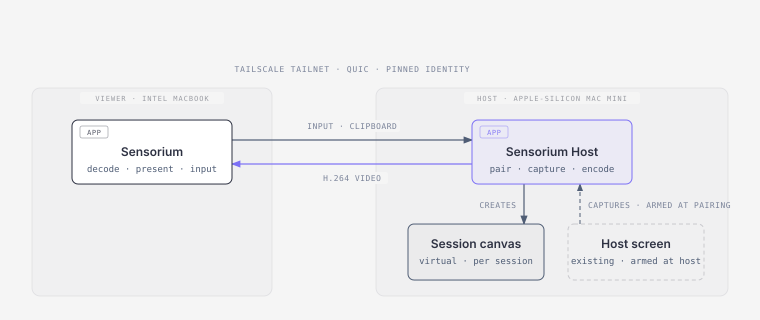

# Sensorium

A private remote workstation for two machines. You sit at the viewer and work
on a virtual display the host creates for you. With permission granted at
the host, you can also see and control one of its real screens.

Two apps, nothing else:

- **Sensorium** runs on the machine you sit at.
- **Sensorium Host** runs on the machine you work on.

No account, no relay, no telemetry, no command line.

## Requirements

- One viewer machine and one host machine.
- macOS 13 or later on both machines. Built and tested only on macOS 26.
  Linux support is planned.
- Both on the same Tailscale tailnet. Nothing else can reach the host.

## Getting started

1. Build both apps with `SENSORIUM_ALLOW_ADHOC=1 ./Scripts/package-apps.sh`. See [Install](docs/install.md) to keep permissions across rebuilds.
2. Open Sensorium Host on the host machine. Grant what its window asks for.
3. Open Sensorium on the viewer machine. Pick the host. Type the six-digit code.

Docs:

- [Install](docs/install.md)
- [Permissions](docs/macos-permissions.md)
- [Privacy](docs/privacy.md)
- [Threat model](docs/threat-model.md)
- [Wire protocol](docs/protocol.md)
- [Host screen mode](docs/host-screen-design.md)
- [User interface spec](docs/ux-spec.md)
- [Design system](docs/design-system.md)
- [Testing](docs/testing.md)
- [Uninstall](docs/uninstall.md)

## Uninstall

Nothing runs in the background, so removal is manual. On each machine:

1. Quit the app. On the host, end any session first so its canvas is released.
2. Delete `Sensorium.app` or `Sensorium Host.app`.
3. Delete its data, which forgets the pairing:
   `rm -rf ~/Library/Application\ Support/Sensorium`
4. Remove its permission rows in System Settings, Privacy & Security.

If you added the optional PF firewall rule, see [Uninstall](docs/uninstall.md).

## Status

Works between the two machines it was built for. Pairing, virtual display,
pinned-identity QUIC transport, H.264 video, input, clipboard and reconnect
all run. Host screen mode and its opt-in lock-screen unlock run too. Not
signed, not notarized, not yet tested on other hardware.

## Development

Swift 6. No dependencies. No Xcode needed. Run the tests with
`./Scripts/run-unit-tests.sh`. See [testing](docs/testing.md) and
[CONTEXT.md](CONTEXT.md) for the words the code uses.

## Not in v1

- Changing physical displays. One exception: a host screen's resolution,
  on request, restored afterwards.
- Backend, accounts, browser viewer, relay, telemetry.
- Audio, file transfer, multiple users, pre-boot (FileVault) unlock.

## License

GPL-3.0. Copyright (c) 2026 blutarche.
